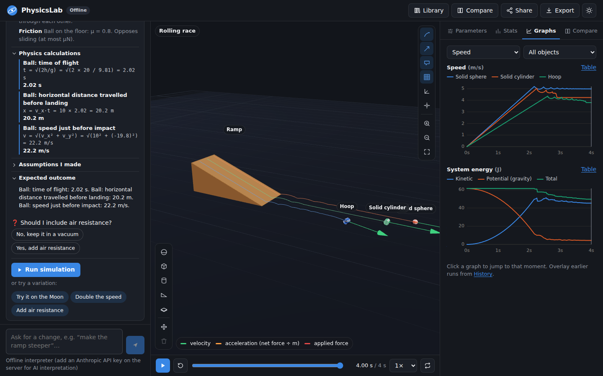
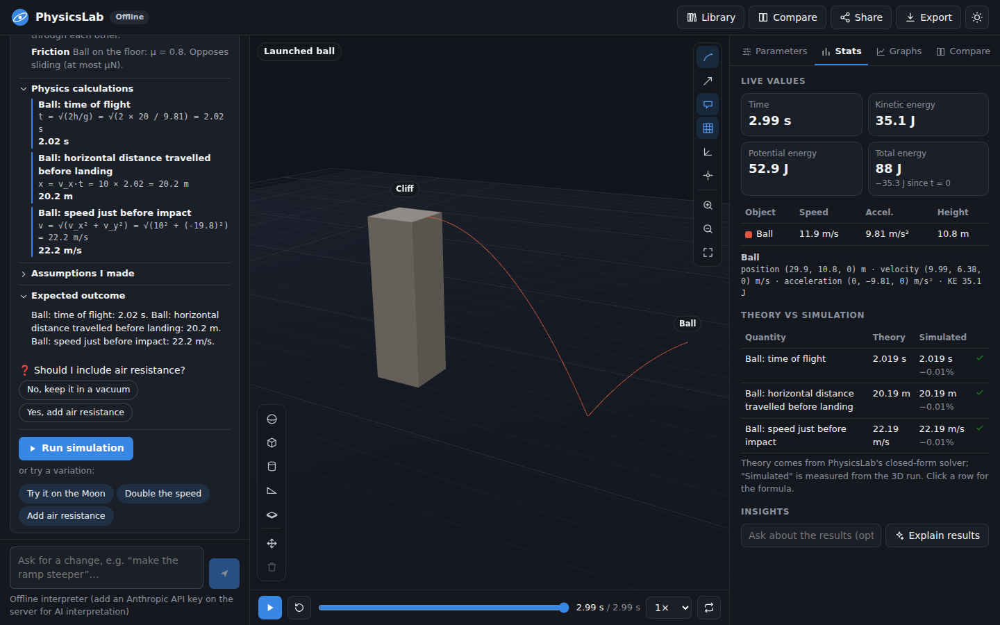

# PhysicsLab

**Describe a physics experiment in plain language and get an interactive, physically accurate 3D simulation you can tweak, compare, and learn from.**

> "A ball of mass 2 kg rolling down a frictionless ramp at 30 degrees"
> → PhysicsLab explains how it interpreted that (objects, forces, worked calculations, assumptions,
> clarifying questions), runs it in 3D, and checks the simulation against closed-form physics.





## Quick start

Requires Node 20+.

```bash
npm install
cp .env.example .env              # optional: add ANTHROPIC_API_KEY to enable AI interpretation
export $(grep -v '^#' .env | xargs) # or set the variables however you prefer

npm run dev                       # API on :8787, app on http://localhost:5173
```

Production (one process serves the API and the built app on `PORT`, default 8787):

```bash
npm run build
npm start
```

Without an API key everything still works: descriptions go through PhysicsLab's built-in
rule-based interpreter, which handles the classic textbook setups (ramps, projectiles, drops,
pendulums, springs, collisions, orbits, pushes, towers) and follow-up edits like "make it steeper" or
"try it on the Moon". With a key, Claude Opus 5.5 interprets arbitrary descriptions.

| Variable | Default | Purpose |
|---|---|---|
| `ANTHROPIC_API_KEY` | — | Enables AI interpretation and explanations. |
| `PHYSICSLAB_MODEL` | `claude-opus-5-5` | Model used for interpretation and explanations. |
| `PHYSICSLAB_EFFORT` | `medium` | Reasoning effort for interpreting descriptions (`low`…`max`). |
| `PHYSICSLAB_EXPLAIN_EFFORT` | `low` | Effort for "explain the results" requests. |
| `PHYSICSLAB_AI` | — | `off` forces the offline interpreter. |
| `PHYSICSLAB_RATE_LIMIT` | `20` | AI requests per client IP per minute (the rest fall back to offline). |
| `PORT` | `8787` | Server port. |

## What you can do

**1. Describe → interpret → approve.** Type a description (or pick an example). The interpretation card
shows the objects and their properties, every force (gravity, normal, friction with μ, tension,
springs, applied forces, drag), worked calculations with numbers substituted, the assumptions that
were made, the expected outcome and the physics behind it. Ambiguities become clickable clarifying
questions ("You said 'rolling' on a frictionless ramp — slide or roll?"). Impossible or contradictory
input is flagged with a one-click fix: negative mass, zero mass, faster-than-light (and a warning
above 0.1c), objects that are fixed yet moving, restitution above 1, overlapping objects, objects
starting inside the floor.

**2. Run it in 3D.** Play/pause/reset, a scrubbable timeline, slow motion (0.1×–4×), looping,
orbit/zoom/pan and a follow camera, trajectories, velocity/acceleration/applied-force arrows,
labels, grid and axes. Spheres and cylinders are striped, so rolling and sliding look different.

**3. Tweak parameters live.** Every mass, size, friction and restitution coefficient, velocity,
position, ramp angle, pendulum length and angle, spring stiffness and damping, force magnitude and
timing, gravity and duration has a slider. The simulation re-runs in a Web Worker as you drag.
"Explain the effect" compares the new run with the previous one ("Doubling the mass didn't change the
acceleration — both mg and the inertia doubled…"), using Claude when available and a rule-based
tutor otherwise.

**4. Check the physics.** The Stats tab shows live position, velocity, acceleration and energy, and
a **Theory vs simulation** table. PhysicsLab's closed-form solver predicts the key quantities
(accelerations, times, speeds, ranges, periods, bounce heights, post-collision velocities, orbital
periods, energy conservation) and measures the same quantities from the 3D run.

**5. Compare and keep history.** Side-by-side mode runs variant A and variant B together with synced
cameras, a metrics table with differences, and overlaid graphs. Every run is kept in History with its
key results; overlay earlier runs on the graphs or restore them.

**6. Build visually.** Add spheres, boxes, cylinders, ramps and plates. Click or right-click an
object to edit it, drag it in move mode, and pick a material (steel, rubber, ice, ...) to get
suggested friction, restitution and mass. Add forces or impulses to any object.

**7. Save, share, export.** Save to a personal library in the browser. Share links carry the whole
scenario in the URL fragment. Export CSV time series, a Markdown report (interpretation, predictions
vs results, metrics), the scenario JSON, or a PNG snapshot. There are 14 built-in classic experiments,
and the layout works on phones and tablets.

## How it works

```
shared/   @physicslab/shared — used by both the server and the browser
  schema.ts        Scenario format (zod). Accepts the spec's JSON shape and loose AI output.
  resolve.ts       Defaults, derived masses, placement helpers → exact coordinates, contact rule
  validate.ts      Physics validation with machine-applicable fixes
  sim/engine.ts    cannon-es world with PhysicsLab's accuracy fixes (below)
  sim/simulate.ts  Deterministic fixed-step run → sampled recording (+ energy, contact events)
  analysis/        Closed-form predictions, measurements on recordings, run metrics
  interpret/       Offline interpreter, scenario descriptions, rule-based explanations
  presets.ts       Scenario library
server/   Express API
  ai/claude.ts     Claude integration (structured outputs, validation + repair, fallbacks)
  ai/prompts.ts    System prompts   ai/wire.ts  Structured-output JSON schemas
  app.ts           /api/health, /api/interpret, /api/explain (+ serves the built client)
client/   React + Three.js app (Vite)
  three/SceneView.ts   Rendering, camera, trails, vectors, selection, drag-to-move
  sim/                 Web Worker that runs simulations off the UI thread
  store.ts             App state (zustand): variants A/B, playback, chat, history, explanations
```

**Simulate once, then play back.** A scenario is resolved to exact initial conditions and simulated
headlessly at a fixed step (1/240 s, smaller for fast or thin objects to avoid tunnelling), then
played back from the recording. That makes runs deterministic, lets you scrub time freely, and
gives the graphs, comparisons and measurements the full time series right away. Typical scenarios
simulate in 20–200 ms.

**Placement helpers instead of hand-computed coordinates.** A scenario can say "on ramp `ramp_1`,
0.2 m from the top", "on the ground", "on top of `table`" or "pendulum from anchor A, length L,
released at θ", and the resolver computes exact positions and orientations. This removes the most
common source of broken AI-generated scenes: objects floating above slopes or sunk into them.

### Physics accuracy

Stock cannon-es is built for games, not for teaching physics. PhysicsLab corrects it and checks
the corrections in its tests:

| Issue in stock cannon-es | Effect | PhysicsLab fix |
|---|---|---|
| Friction impulse bounded by μ·m·g per contact point (not μ·N·dt) | A box sliding at 5 m/s with μ = 0.3 stops after 1.4 m instead of 4.25 m | Bound = μ × previous-step normal force × dt, shared across the contact points |
| Friction tangents aren't unit vectors on tilted contacts | Friction on a 30° slope is 13% too weak | Tangents normalised and aligned with the sliding direction (also fixes anisotropy) |
| Inertia approximated by each body's bounding box | Solid sphere gets I = ⅔mr² (a hollow sphere's) and rolls too slowly | Exact tensors for solid/hollow spheres, cylinders and boxes |
| Soft-contact restitution | Bounce heights too low and dependent on step phase | Impacts target exactly v' = −e·v, penetration removed by position projection |
| Cylinders are faceted prisms | Rolling cylinders lose energy at every facet | Round rolling surface from axis spheres |
| Default damping, product-rule materials | Unphysical energy loss; μ = 0.5 × 0.5 gives 0.25 | Zero damping; the effective coefficient is the smaller of the two surfaces' (or a pair override) |

Measured agreement between the simulation and closed-form physics (the tests enforce 2–3%
tolerances; these are the actual errors for the built-in scenarios):

| Scenario | Quantity | Error |
|---|---|---|
| Frictionless ramp, 30° | acceleration / time to bottom / speed at bottom | 0.00% / 0.14% / 0.14% |
| Rolling race: solid sphere, solid cylinder, hoop (20°) | acceleration g sin θ / (1 + I/mr²), time, speed | < 0.1% |
| Box on a rough incline (μ = 0.2, 35°) | a = g(sin θ − μ cos θ), time, speed | < 0.05% |
| Horizontal throw from a 20 m cliff | time of flight, range, impact speed | < 0.02% |
| Bouncing ball, e = 0.8 | fall time, impact speed, first bounce height (e²h) | < 0.5% |
| 45° pendulum (exact large-angle period) | period, speed at bottom | < 0.05% |
| Mass on a spring | period 2π√(m/k), max speed | < 0.01% |
| Elastic (e = 1) and inelastic (e = 0.5) head-on collisions | final velocities | < 0.05% |
| Two-body orbit | Kepler period | 0.02% |
| Hammer and feather on the Moon | fall time (identical for both) | 0.04% |
| Energy conservation (pendulum, spring, orbit) | drift over the run, % of peak kinetic energy | < 0.6% |

### AI integration (Claude Opus 5.5)

- `/api/interpret` sends the description, the current scenario (for follow-up edits) and recent
  conversation turns. It uses **structured outputs**: a JSON schema of every field, all required and
  with sentinels instead of optional fields or unions. The reply is then always parseable JSON with
  the interpretation, the scenario and suggested variations.
- The scenario is validated with the same schema and resolver the app uses. If anything fails
  (unknown ids, bad placement targets), the model gets one repair turn with the exact errors.
- The system prompt is static and cached. It teaches the model the coordinate system, the placement
  helpers, the contact rule and the validation policy (never simulate negative mass, ask about
  contradictions, warn above 0.1c), and asks for exact worked calculations. The app re-derives those
  calculations with its own solver and compares them with the simulation.
- Adaptive thinking with configurable effort. No forced tool use (Opus 5.5 rejects it), streaming
  requests, typed error handling, rate limiting, and an automatic fallback to the offline
  interpreter (with the reason shown) if the API is unavailable, declines a request or returns
  something that doesn't validate.
- `/api/explain` is a physics tutor. It gets the before/after scenarios, the parameter diff, run
  metrics and theory-vs-simulation values, and returns an explanation, key points and follow-up
  experiments as applicable parameter changes.

### Scenario format

Scenarios follow the structure in the PhysicsLab spec: `metadata`, `environment`, `objects`,
`forces`, `expected_outcome`, `physics_notes`. There are two additions: `links` (rods and springs)
and `contacts` (pair-specific coefficients). The parser also accepts the spec's compact example
format (`scenario_name`, top-level `gravity`, `"type": "plane"` with an `angle`, and so on).

```jsonc
{
  "metadata": { "name": "Ball on a frictionless ramp" },
  "environment": { "gravity": 9.81, "simulation_duration": 3, "ground": true },
  "objects": [
    { "id": "ramp_1", "type": "ramp", "dimensions": { "length": 5, "angle": 30 }, "material": { "friction_coefficient": 0 } },
    { "id": "ball_1", "type": "sphere", "mass": 2, "dimensions": { "radius": 0.1 },
      "placement": { "kind": "on_ramp", "target_id": "ramp_1", "distance_from_top": 0.15 } }
  ],
  "forces": []
}
```

Units are SI with y up and the floor at y = 0. Angles in scenarios are in degrees.

## Development

```bash
npm test            # vitest: physics accuracy, parser, schema, server (fake Anthropic client), client libs
npm run typecheck   # all three packages
npm run build       # production client bundle
```

## Limitations and roadmap

- Rigid bodies only. Relativity, fluids and buoyancy, magnetism, deformable bodies, slack ropes and
  hinges aren't modelled yet. The validator warns when a request needs them (e.g. speeds above 0.1c).
- Saved scenarios and run history live in the browser (localStorage). Share links carry the full
  scenario, so no server storage is needed. A database (Supabase or Firebase) for accounts and a
  community library is the next step.
- Force arrows are edited as numbers and sliders rather than drawn in the scene.
- Reports are Markdown with tables. PNG snapshots of the scene can be exported separately.
